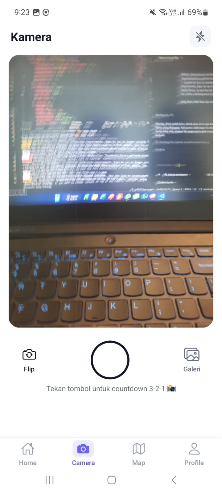
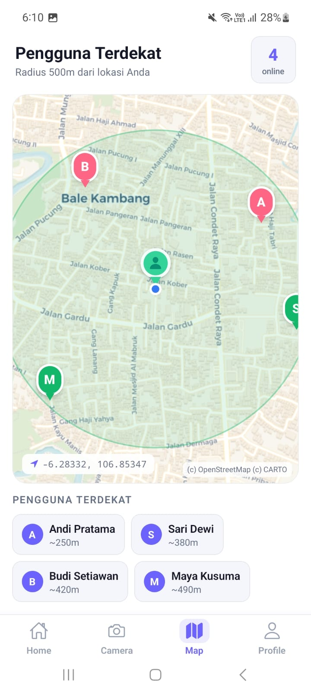

# Social App

## Informasi Mahasiswa
- **Nama** : Zulfikar Hasan  
- **NIM** : 2410501016  
- **Kelas** : B  

---

## Deskripsi
SocialApp adalah aplikasi mobile yang mensimulasikan fitur sosial media seperti feed post, kamera story, peta pengguna terdekat, dan profil pengguna. 
Aplikasi ini juga memakai beberapa API perangkat seperti kamera, lokasi, galeri, sharing, file system, deep linking, dan local notification.

---

 ## Dependencies utama :

- `@react-navigation/native`
- `@react-navigation/bottom-tabs`
- `@expo/vector-icons`
- `expo-camera`
- `expo-image-picker`
- `expo-image-manipulator`
- `expo-location`
- `react-native-maps`
- `expo-notifications`
- `expo-file-system`
- `expo-sharing`
- `expo-media-library`
- `expo-linking`

---

## Fitur yang dikemabngakan
- Bottom Tab Navigation dengan halaman Home, Camera, Map, dan Profile.
- Feed post dengan dummy data, tombol like, komentar, simpan, dan bagikan.
- Camera story menggunakan `CameraView`, flip kamera, flash toggle, preview foto, dan countdown 3-2-1.
- Pilih foto dari galeri, crop rasio 1:1, resize maksimal 800px, dan kompres sebelum diposting.
- Map pengguna terdekat menggunakan lokasi GPS user dan marker dummy di sekitar posisi user.
- Local notification untuk simulasi chat masuk menggunakan `expo-notifications`.
- Save foto ke galeri dan share file menggunakan `expo-media-library` dan `expo-sharing`.
- Permission flow dengan penjelasan sebelum meminta akses kamera, galeri, lokasi, dan penyimpanan media.

---

## Screenshot Preview

<p>
  
  
  
  
</p>

## Cara Menjalankan

Aplikasi ini menggunakan **Expo** dan **Firebase**.

### 1. Clone Repository
```bash
git clone <URL_REPOSITORY>
```

### 2. Masuk Ke Folder Project
```bash
cd SocialApp
```

### 3. Install Dependencies
```bash
npm install
```


### 4. Jalankan Aplikasi
```bash
npx expo start
```
